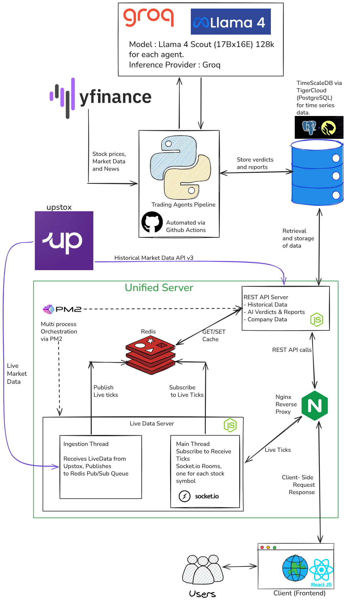

# ArthNeeti Backend

> A Stock Charting platform empowering users with Agentic AI Analysis based Buy/Sell/Hold recommendations.

## System Design Diagram : 



---

## Prerequisites

- [Node.js](https://nodejs.org/) (v16+ recommended)
- [Nginx](https://nginx.org/)

---

## Setup

Install dependencies:

```bash
npm install
```

---

## Running the Servers

### Development
Starts both API and live-tick servers with hot-reload and nginx:

```bash
npm run dev
```

### Production
Starts both servers and nginx in production mode:

```bash
npm start
```

---

## Stopping the Servers

Gracefully stop all servers and nginx:

```bash
npm stop
```

If processes do not stop properly, run:

```bash
npx pm2 stop all
nginx -c $(pwd)/nginx.conf -s stop
```

---

## Viewing Logs

Show combined logs for both servers:

```bash
npm run logs
```

Show logs for only the REST API server:

```bash
npm run logs-rest-api
```

Show logs for only the live-tick server:

```bash
npm run logs-live-tick
```

---

## API Endpoints

**Via Nginx (recommended):**

- http://localhost:8080/api &nbsp;&nbsp;→ REST API server
- http://localhost:8080/ws  &nbsp;&nbsp;&nbsp;→ Live tick WebSocket server

**Direct (bypassing nginx):**

- http://localhost:3001/api &nbsp;&nbsp;→ REST API server
- http://localhost:3002/ws  &nbsp;&nbsp;&nbsp;→ Live tick WebSocket server

---

## Notes

- All process management is handled by [PM2](https://pm2.keymetrics.io/).
- Nginx is configured via `nginx.conf` in the project root.
- For custom configuration, edit `ecosystem.config.cjs` (PM2) or `nginx.conf` as needed.
- No build step is required; just install dependencies and start the servers.

---

## Troubleshooting

- If you encounter issues with ports already in use, ensure all related processes are stopped (`pm2 list`, `pm2 delete all`, and check for nginx processes).